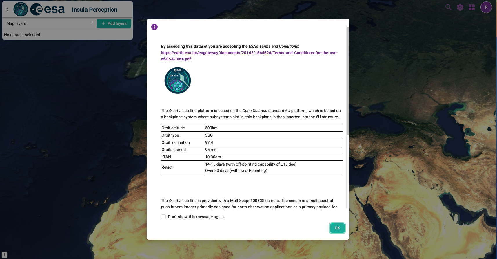
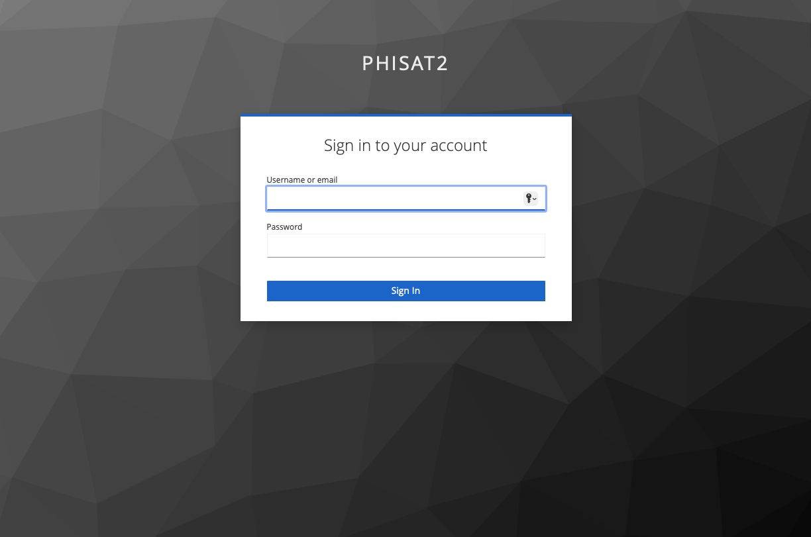
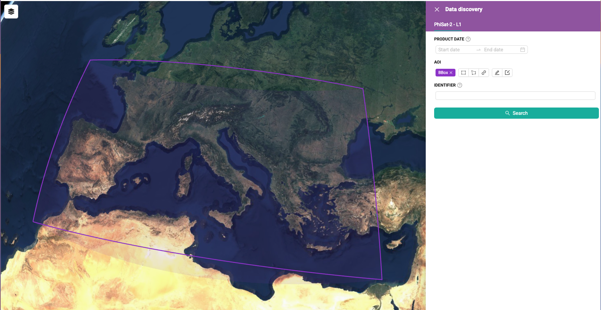
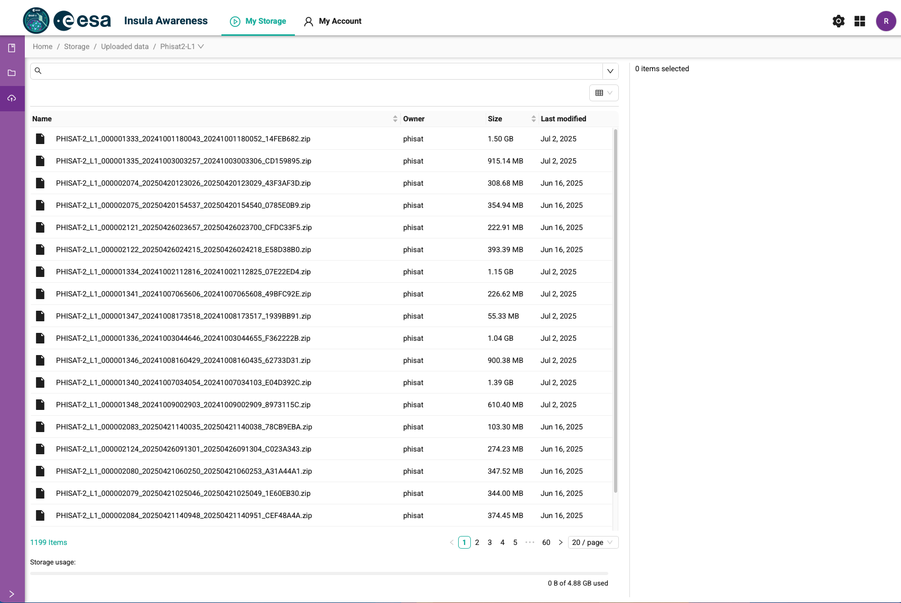

# Φ-sat-2 Data Access Guide

> **Φ-sat-2** is a multispectral Earth observation mission providing freely accessible satellite data through the Insula platform.

## Overview

Φ-sat-2 satellite data are made freely available to the scientific community and industry through the **Insula platform**, professionally managed by CGI Italy. This platform provides comprehensive access to hyperspectral Earth observation data for research, commercial, and educational purposes.

## Registration Process

To access Φ-sat-2 data, please follow these steps:

### 1. Submit Registration Request
Send your registration request to: **`insula-info.it@cgi.com`**

### 2. Required Information
Please include the following details in your registration email:

- **Full Name**
- **Institutional Affiliation**
- **Intended Purpose** of data usage
- **Contact Email Address**

### 3. Account Activation
- Wait for confirmation and access credentials from the platform administrators
- You will receive login details upon approval

### 4. Platform Access
Once your account is activated, log in to the Insula platform using your provided credentials.

**🔗 [Access the Φ-sat-2 Collection](https://phisat2.insula.earth/)**

## Using the Platform

### Authentication

### Data Search & Discovery
Search for specific products by defining your area of interest and temporal range:

### Database Access
Browse the complete data catalog:

## Data Search Options

The platform offers flexible data discovery methods:

- **Spatial Search**: Define polygons or bounding boxes for your area of interest
- **Temporal Search**: Specify start and end dates for data acquisition
- **Catalog Browse**: Access the complete database for comprehensive data exploration

---

*For technical support or additional information, please contact the Insula platform administrators at `insula-info.it@cgi.com`*

